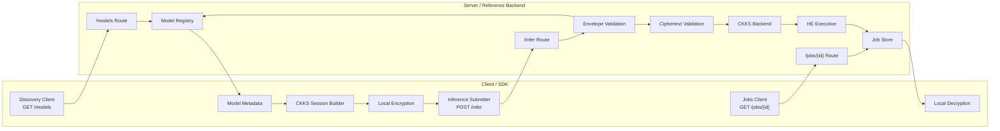

# Architecture

This document describes the structure of the Encrypted Inference API reference implementation and the movement of data across the client, protocol layer, and server.

## System Summary

The system has two major sides:

- **Client / SDK**
- **Server / Reference Backend**

The client discovers model metadata, constructs a compatible CKKS session locally, encrypts inputs, submits ciphertexts, retrieves encrypted results, and decrypts them locally.

The server exposes the protocol routes, validates request envelopes, validates ciphertext compatibility, performs homomorphic evaluation, and stores encrypted results in job state.

## Primary Design Principle

The protocol is designed so that:

- plaintext inputs remain client-side
- decryption capability remains client-side
- the server handles ciphertexts, metadata, and protocol validation
- protocol artifacts define the wire contract
- backend-specific cryptographic logic remains behind a backend abstraction

## Architecture Diagram

## Request Lifecycle

A typical request follows this sequence:

1. The client calls `/models` to discover supported models and encryption requirements.
2. The client constructs a compatible CKKS session locally.
3. The client encrypts input features locally.
4. The client submits a ciphertext-bearing request to `/infer`.
5. The server validates the envelope and resolves the referenced model metadata.
6. The server validates ciphertext structure and compatibility through the crypto backend.
7. The server performs homomorphic evaluation.
8. The encrypted result is stored in job state.
9. The client retrieves the result through `/jobs/{id}` and decrypts it locally.

## Notes

This diagram is implementation-oriented. It is intended to help contributors understand the reference backend quickly, not to replace the normative protocol artifacts.

The protocol contract remains defined by the schemas, OpenAPI description, and documented invariants.
