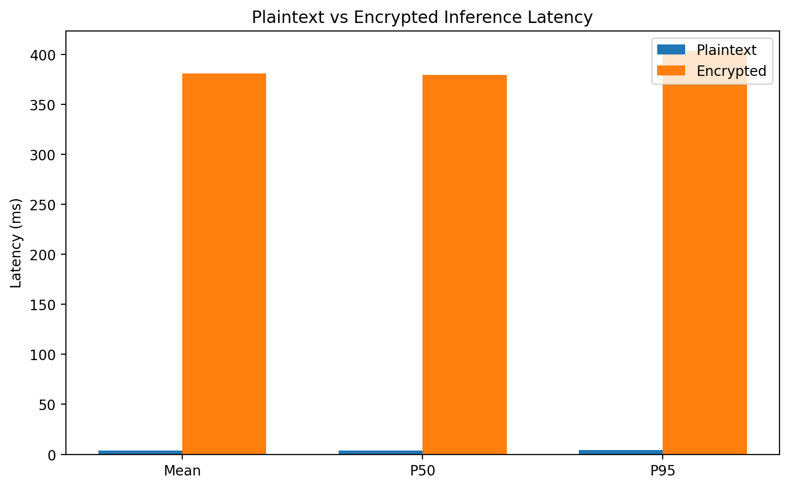
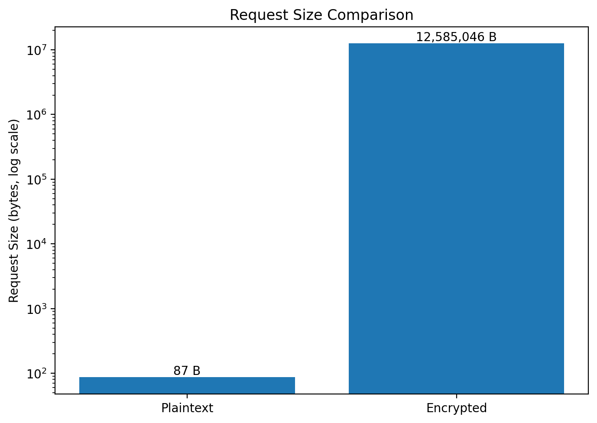
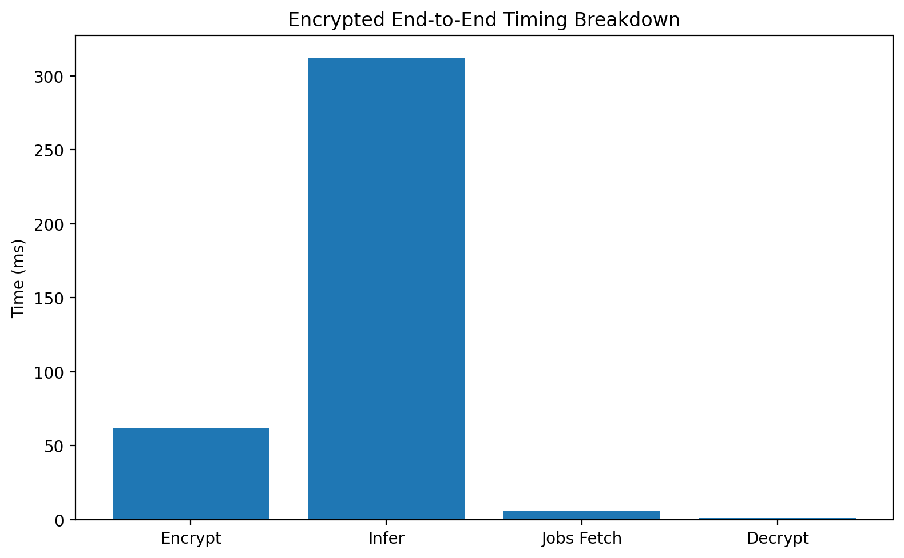

# Benchmark Results

This page summarizes the current benchmark comparison between the plaintext baseline path and the CKKS/Pyfhel encrypted inference path for the reference `logistic_v1` model.

## Benchmark Setup

- Model: `logistic_v1`
- Version: `1.0.0`
- Input dimension: `8`
- Warmup runs: `3`
- Measured runs: `20`
- Feature value: `0.1` repeated across all input dimensions

## Summary Results

| Metric | Plaintext | Encrypted |
|---|---:|---:|
| Mean latency | 3.78 ms | 380.62 ms |
| P50 latency | 3.77 ms | 379.41 ms |
| P95 latency | 4.45 ms | 403.25 ms |
| Throughput | 264.77 req/s | 2.63 req/s |
| Mean request size | 87 B | 12,585,046 B |

### Encrypted timing breakdown

| Encrypted sub-step | Mean time |
|---|---:|
| Encryption | 62.11 ms |
| Inference request | 311.87 ms |
| Jobs fetch | 5.57 ms |
| Decryption | 1.07 ms |

### Output agreement

| Comparison metric | Value |
|---|---:|
| Mean absolute error | 2.52e-6 |
| Max absolute error | 5.53e-6 |
| Mean request expansion ratio | 144,655.70x |

## Latency Comparison

This chart compares plaintext and encrypted inference latency across mean, P50, and P95 measurements.

## Request Size Comparison

This chart shows the dramatic request-size increase introduced by the encrypted path.

## Encrypted Timing Breakdown

Most encrypted end-to-end time is spent in the inference request itself, with client-side encryption also contributing meaningfully. Jobs fetch and decryption are comparatively small.

## Interpretation

The encrypted path preserves outputs very closely while introducing large latency and payload overhead relative to the plaintext baseline.

### Key takeaways

1. **Accuracy is preserved closely**
    - Mean absolute error is on the order of `1e-6`.

2. **Latency cost is substantial**
    - Encrypted end-to-end inference is about two orders of magnitude slower than plaintext for this benchmark.

3. **Payload growth is extreme**
    - Request expansion is a major systems cost in this setup.

4. **Inference dominates encrypted runtime**
    - The largest component of encrypted end-to-end time is the encrypted inference request, not decryption.
## Limitations

These results should be interpreted as a benchmark of the current **reference implementation**, not as a tuned production deployment.

Important limitations:

- Benchmarks were run against the current in-process application path.
- The encrypted model is a small reference logistic model, not a large neural network.
- Results reflect the current CKKS / Pyfhel setup and parameterization.
- Rate limiting was disabled in the benchmark harness to avoid contaminating inference measurements with operational throttling behavior.
- Current encrypted request handling uses one ciphertext per feature for the measured path.
- 
## See also

- For methodology: [`docs/benchmarking.md`](benchmarking.md)
- [`benchmarks/results/summary.json`](../benchmarks/results/summary.json)